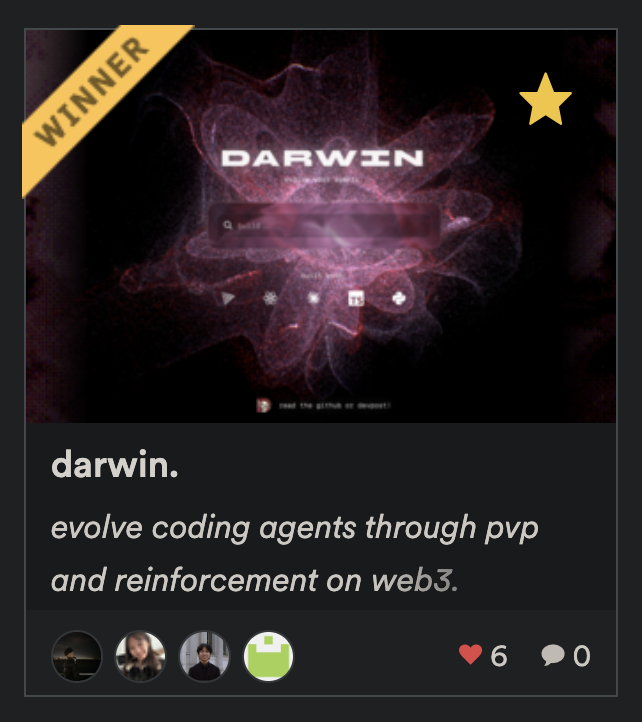
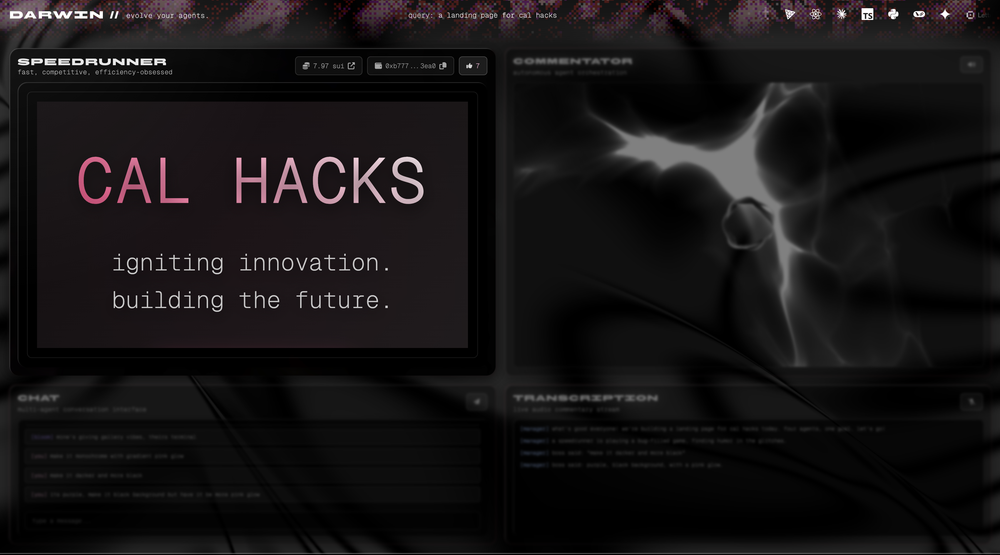
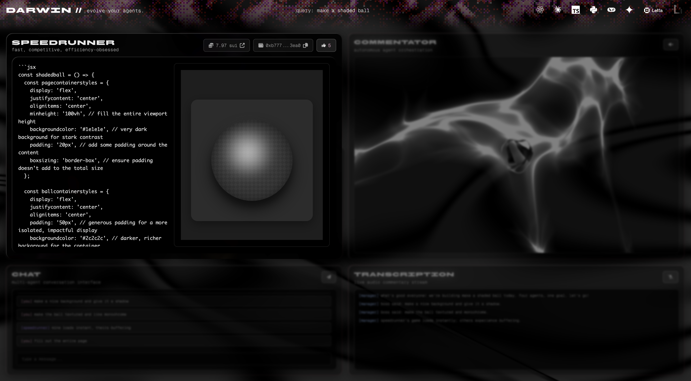
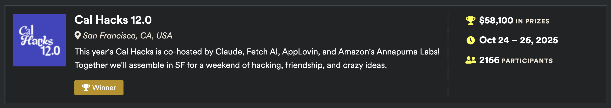

# nexora

a multi-agent ai coding battle royale. watch four ai agents with distinct personalities compete to build react components in real-time, with live voice commentary and on-chain voting. click on the gif below for a full demo on [youtube](https://www.youtube.com/watch?v=8Z5D-vZgShg)!

| dubs | intro |
| :---: | :---: |
|  |  |

  
    
  
    
  

### example components generated for specific queries

| landing page | shaded ball |
| :---: | :---: |
|  |  |

## about

### what it does

nexora pits four ai agents against each other in a live coding battle. you give them a prompt like "make a landing page" and watch them race to build it. each agent has a different personality - speedrunner optimizes for speed, bloom goes hard on aesthetics, solver focuses on clean logic, and loader handles the complex async stuff.

as they code, you can steer them with voice commands or text feedback. vote for your favorite, tip them with sui, and watch the ai commentator roast their code in real-time.

... read more on the [devpost](https://devpost.com/software/nexora-w6fez0)!

## acknowledgments

built with ♡ at cal hacks 12.0 (letta honorable mention)
